# 🚀 Freelance Connect – Laravel Platform

A complete **Freelance Marketplace Platform** built with **Laravel**, providing a seamless experience for **Clients** and **Freelancers** to connect, manage services, exchange messages in real-time, and handle payments securely.

---

## 🧠 Overview

**Freelance Connect** is a full-stack web application that allows:
- **Freelancers** to offer and manage their services.  
- **Clients** to browse, order, and pay for services securely.  
- **Admins** to monitor and control everything from a powerful dashboard.

This project integrates **Laravel Blade + Bootstrap (AdminLTE)** for the UI, **Laravel Sanctum** for API authentication, **Paymob** for payment integration, and **Pusher** for real-time chat communication.

---

## ⚙️ Tech Stack

| Layer | Technologies |
|-------|---------------|
| Backend | Laravel 10+, PHP 8.3 |
| Frontend | Blade, Bootstrap 5 |
| Database | MySQL |
| Authentication | Laravel Sanctum |
| Payment Gateway | Paymob Integration |
| Realtime Chat | Pusher + Laravel Echo |
| Charts | Chart.js |
| API Testing | Postman |

---

## 🧩 Main Features

### 🔐 Authentication
- Register / Login / Logout  
- Role-based access: **Admin**, **Freelancer**, **Client**  
- Token-based authentication with Laravel Sanctum  

---

### 🧾 Services Management (CRUD)
- Freelancers can **Create**, **Update**, and **Delete** their services.  
- Admin can **Approve / Reject** services.  
- Clients can browse approved services easily.  

**Each service includes:**
`title`, `price`, `description`, `status (pending / approved / rejected)`, `freelancer_id`

---

### 💸 Orders & Payments
- Clients can place orders for specific services.  
- Freelancers manage their incoming orders.  
- Integrated **Paymob Payment Gateway** for secure online payments.  

**Tracked fields:**  
`amount`, `payment_status (pending / paid / failed)`, `payment_method`

---

### 💬 Realtime Chat System
- One-to-one chat between **Client** and **Freelancer**.  
- Built using **Pusher** for real-time instant communication.  
- Supports:
  - Text messages  
  - File attachments  
  - Message timestamps  

---

### 🧮 Admin Dashboard
- Built with **AdminLTE (Blade + Bootstrap)**  
- Manage everything in one place:
  - ✅ Approve / Reject Services  
  - 📊 View statistics and charts  
  - 📋 Monitor all users and orders  
- Clean, responsive, and easy to use.  

---

## 📸 Screenshots

| Dashboard | Charts | Create Service |
|------------|---------|----------------|
| 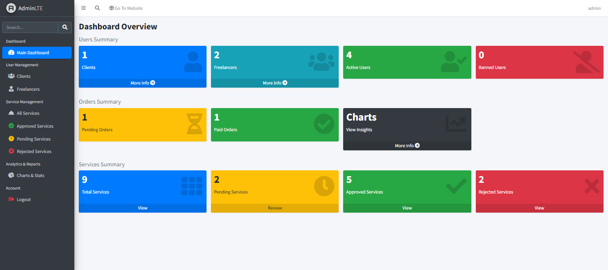 | 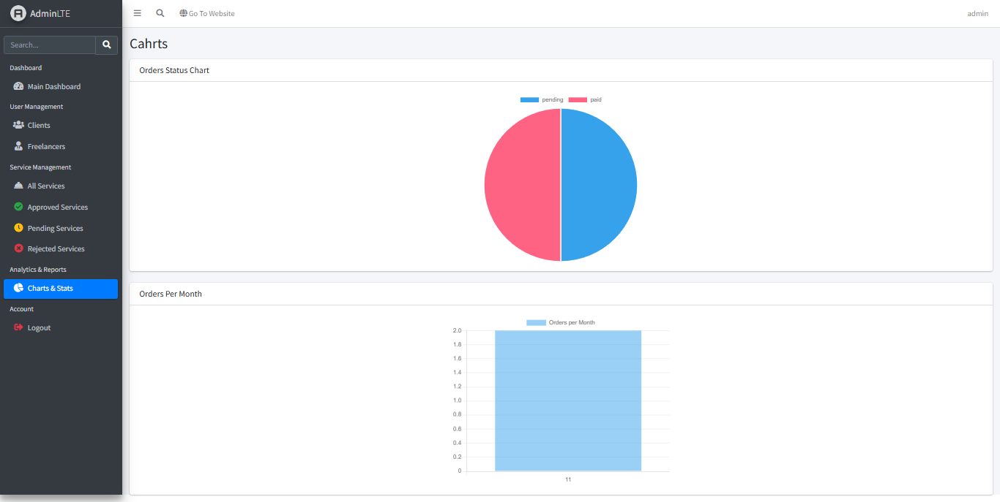 | 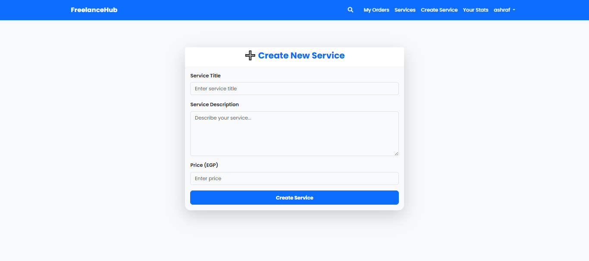 |

| Freelancer Stats | Chat | Login |
|------------------|------|-------|
| 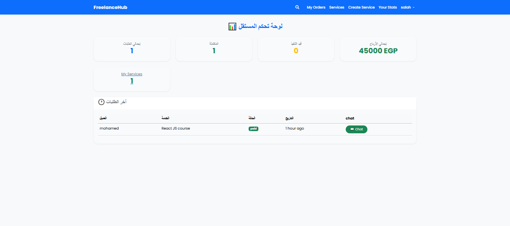 | 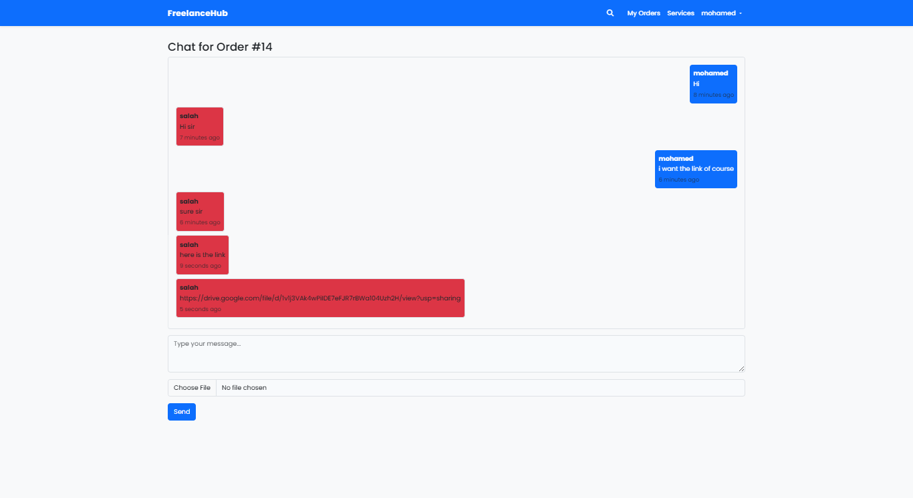 | 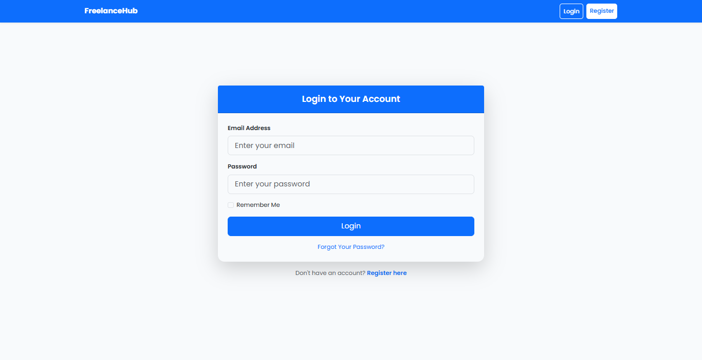 |

| Orders | Payment | Pending Services |
|---------|----------|------------------|
| 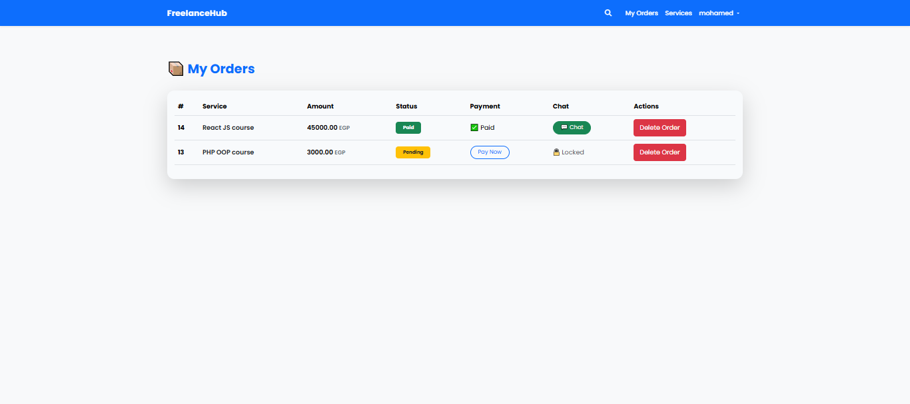 | 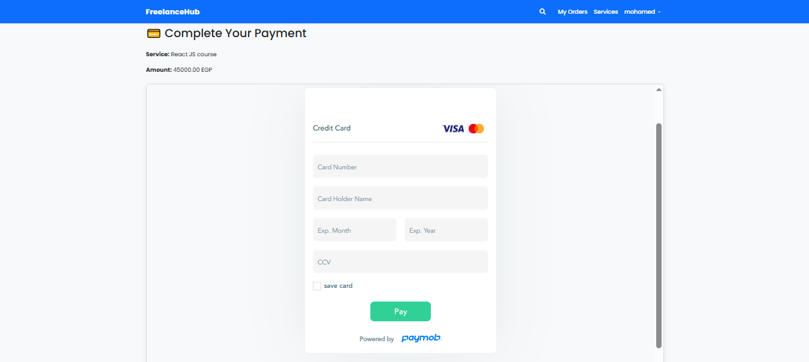 | 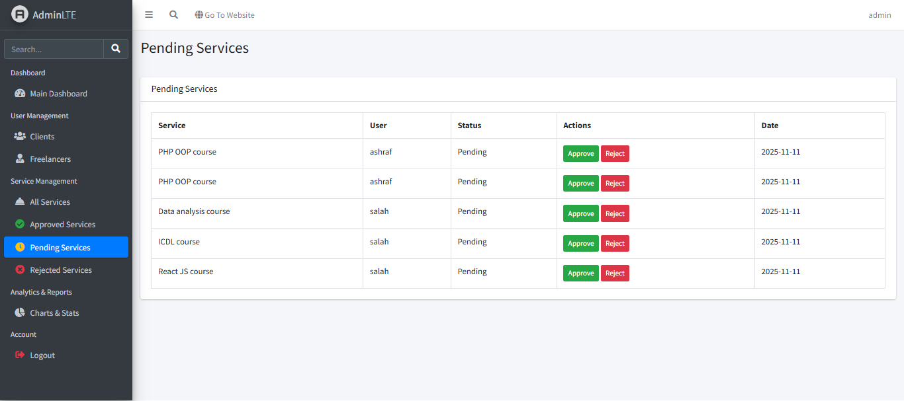 |

| Register | Service List | Service Show |
|-----------|---------------|----------------|
| 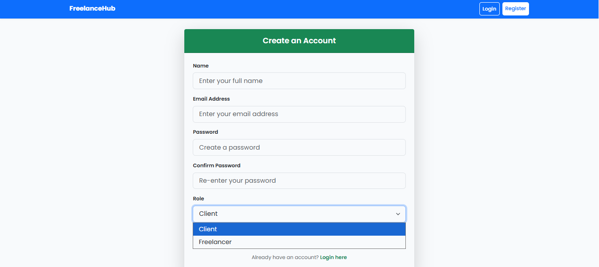 | 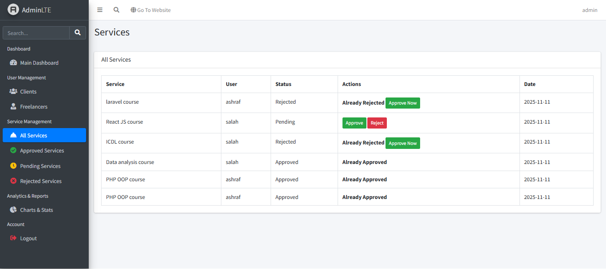 | 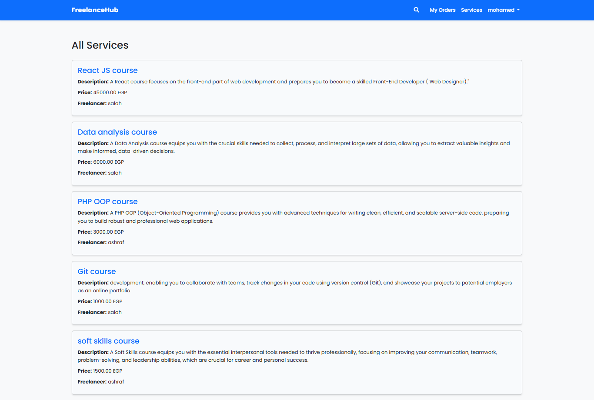 |

---

## 🧱 Database Structure

### 🧍‍♂️ `users`
| Column | Type |
|--------|------|
| id | bigint |
| name | string |
| email | string |
| password | string |
| role | enum(`admin`, `freelancer`, `client`) |

### 🛠️ `services`
| Column | Type |
|--------|------|
| id | bigint |
| title | string |
| price | decimal(10,2) |
| description | text (nullable) |
| status | enum(`pending`, `approved`, `rejected`) |
| freelancer_id | FK(users) |

### 💰 `orders`
| Column | Type |
|--------|------|
| id | bigint |
| amount | decimal(10,2) |
| payment_method | string |
| payment_status | enum(`pending`, `paid`, `failed`) |
| client_id | FK(users) |
| freelancer_id | FK(users) |
| service_id | FK(services) |

### 💬 `chats`
| Column | Type |
|--------|------|
| id | bigint |
| order_id | FK(orders) |

### ✉️ `messages`
| Column | Type |
|--------|------|
| id | bigint |
| chat_id | FK(chats) |
| sender_id | FK(users) |
| message | text |
| file_path | string (nullable) |

---

## 🧠 API Endpoints (Laravel Sanctum Protected)

### 🔑 Auth
  POST /api/register
  POST /api/login
  POST /api/logout
  POST /api/logoutall

#### Services
  GET /api/services
  GET /api/services/{id}
  POST /api/services
  PUT /api/services/{id}
  DELETE /api/services/{id} 

  
#### Orders
  GET /api/orders
  GET /api/orders/{id}
  POST /api/orders
  PUT /api/orders/{id}
  DELETE /api/orders/{id}

 
#### Chat
  GET /api/chats/{id}  // Get messages for a chat
  POST /api/chats/{id}   // Send new message 

  
---

## 🧱 Database Structure

### 🧍‍♂️ `users`
| Column | Type |
|--------|------|
| id | bigint |
| name | string |
| email | string |
| password | string |
| role | enum(`admin`, `freelancer`, `client`) |

### 🛠️ `services`
| Column | Type |
|--------|------|
| id | bigint |
| title | string |
| price | decimal(10,2) |
| description | text (nullable) |
| status | enum(`pending`, `approved`, `rejected`) |
| freelance_id | foreign key (users) |

### 💰 `orders`
| Column | Type |
|--------|------|
| id | bigint |
| amount | decimal(10,2) |
| payment_method | string |
| payment_status | enum(`pending`, `paid`, `failed`) |
| client_id | FK(users) |
| freelance_id | FK(users) |
| service_id | FK(services) |

### 💬 `chats`
| Column | Type |
|--------|------|
| id | bigint |
| order_id | FK(orders) |

### ✉️ `messages`
| Column | Type |
|--------|------|
| id | bigint |
| chat_id | FK(chats) |
| sender_id | FK(users) |
| message | text |
| file_path | string (nullable) |

---

## 🧰 Installation

1️⃣ **Clone the repo**
  
  git clone https://github.com/YOUR_USERNAME/freelance-connect.git
  cd freelance-connect

2️⃣ Install dependencies
  composer install
  npm install && npm run dev

3️⃣ Setup environment
  cp .env.example .env
  php artisan key:generate

4️⃣ Configure database & services
  - Update .env with:

  - DB credentials

  - Paymob API keys

  - Pusher keys

5️⃣ Run migrations
  php artisan migrate --seed

6️⃣ Start server
  php artisan serve

🌐 Realtime & Payment Setup
  Pusher
  
  Add your Pusher credentials to .env:
    PUSHER_APP_ID=xxxx
    PUSHER_APP_KEY=xxxx
    PUSHER_APP_SECRET=xxxx
    PUSHER_APP_CLUSTER=mt1
  
  
  Paymob
  
    PAYMOB_API_KEY=your_paymob_key
    PAYMOB_INTEGRATION_ID=xxxx
    PAYMOB_IFRAME_ID=xxxx

## ⚙️ Queue Worker (For Realtime Chat & Notifications)

To ensure messages are delivered instantly via **Pusher**, you must run the Laravel queue worker.

  Run this command in a separate terminal:
  
    php artisan queue:work
    
  **⚠️ This worker must stay running in the background for real-time chat and queued jobs to function properly.**

## 🧑‍💻 Author
 **Mohamed Ashraf**  
  📧 Email: mohamed_ashraf4444@hotmail.com  
  🌐 GitHub: [https://github.com/salah3122001](https://github.com/salah3122001)  
  🔗 LinkedIn: [https://www.linkedin.com/in/mohamed-ashraf-14916a367](https://www.linkedin.com/in/mohamed-ashraf-14916a367)
       

--- 

0#### Auth Routes
